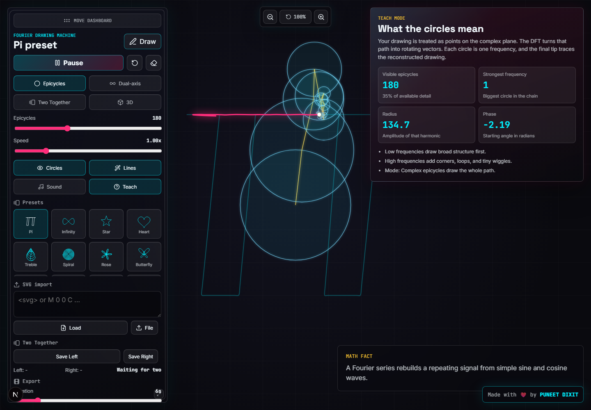

# Fourier Transform Drawing Machine

Interactive Next.js app that turns drawings, presets, and SVG paths into Fourier epicycle animations. Draw a path, decompose it with a custom DFT engine, and watch rotating circles rebuild the shape in real time.

Live app: https://fourier-transform-drawing-machine.vercel.app

## Screenshot



## Features

- Freehand mouse and touch drawing with interpolated pointer capture.
- Custom TypeScript DFT implementation for complex epicycle reconstruction.
- Preset gallery with Pi, infinity, star, heart, treble, spiral, rose, butterfly, atom, wave, bolt, and Lissajous shapes.
- Adjustable epicycle count, playback speed, zoom, circles, and radius lines.
- Teach mode on by default with dynamic metrics for visible epicycles, strongest frequency, radius, and phase.
- Dual-axis mode that separates X and Y component motion.
- Two Together mode for saving and comparing two drawings side by side.
- Three.js 3D mode with stronger camera orbit and depth rotation.
- Soothing Web Audio mode with sine/triangle Fourier voices, stereo spread, low-pass filtering, and delay.
- SVG paste/upload import.
- Fourier amplitude spectrum visualization.
- GIF and MP4/WebM canvas export with user-selected duration.
- Draggable and resizable glass dashboard.
- Browser tab branding with an epicycle favicon, `FTD MACHINE` title, and `HI` away-state title.
- Rotating math fact board and embedded maker link: Made with ❤️ by PUNEET DIXIT.

## Tech Stack

- Next.js App Router
- React + TypeScript
- Raw HTML Canvas for 2D drawing and epicycles
- Three.js for 3D mode
- Web Audio API for sound mode
- Vitest for unit tests
- Playwright for browser smoke tests
- Vercel for hosting

## Development

```bash
npm install
npm run dev
```

Open http://127.0.0.1:3000.

## Verification

```bash
npm run test:run
npm run lint
npm run build
npm run test:e2e -- tests/smoke.spec.ts --reporter=list --workers=1
```

The smoke test verifies the main canvas UI, tab title/favicon behavior, default Teach mode, dynamic epicycle metrics, zoom controls, dashboard drag/resize, 3D canvas rendering, sound activation, and GIF export.

## Deployment

The project is ready for Vercel:

```bash
npx vercel deploy --prod --yes
```

Production is aliased to:

https://fourier-transform-drawing-machine.vercel.app
